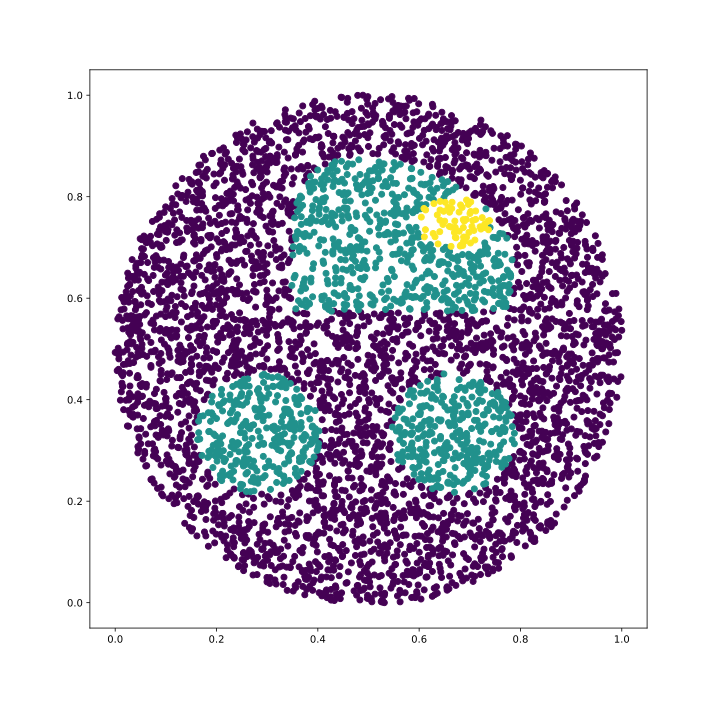

# SVGSampler
This is a small project to quickly create 2D multiclass-datasets for machine learning applications.

You can install it using pip:

```
pip install svg_sampler
```

Then you can use the function `sample_from_svg` to sample datapoints from the filled in paths/objects of the svg.

# Example:


```python
from svg_sampler import sample_from_svg
from matplotlib import pyplot as plt

X, y = sample_from_svg("test.svg", 5000, normalize=True, sample_setting="based_on_area", overlap_mode="upper_only")
plt.scatter(X[:, 0], X[:, 1], c=y)
plt.show()
```


# Documentation

## `sample_from_svg`

```python
sample_from_svg(path, total_samples, sample_setting="equal_over_classes", overlap_mode="all", normalize=False)
```

### Parameters

- **`path`** *(str)*: Path to the SVG file.
- **`total_samples`** *(int)*: Total number of points to sample.
- **`sample_setting`** *(str)*: Sampling mode. Options:
  - `"equal_over_classes"` – Union shapes by fill and sample equally.
  - `"equal_over_shapes"` – Sample equally from each shape.
  - `"based_on_area"` – Allocate samples proportional to the shape's area.
- **`overlap_mode`** *(str)*: Overlap handling mode. Options:
  - `"all"` – Sample from all overlapping shapes.
  - `"upper_only"` – Only sample from the top (upper) shape in overlapping regions.
- **`normalize`** *(bool)*: If True, normalize the sampled coordinates per axis to [0, 1].

### Returns

- **`X`** *(ndarray)*: Array of shape (N, 2) with (x, y) coordinates.
- **`y`** *(ndarray)*: Numeric class labels for each sample point.
- **`label_dict`** *(dict)*: Mapping from original fill colors to numeric labels.


# Dependencies

    numpy
    shapely
    svgpathtools
    matplotlib
